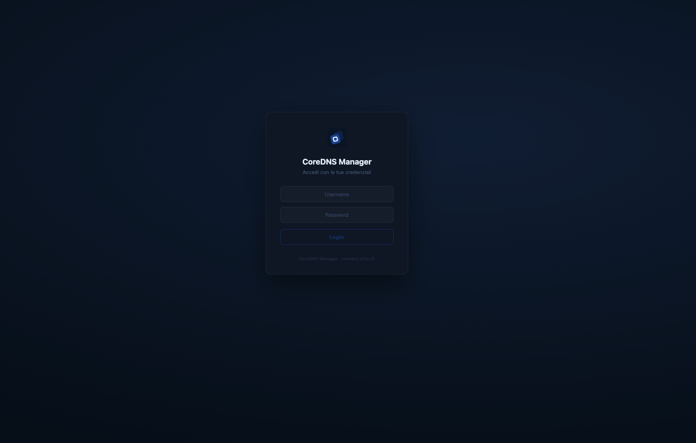
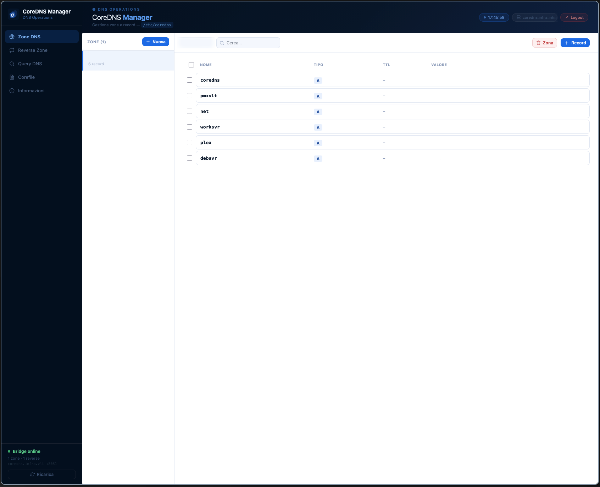

<p align="center">
  
</p>

<h1 align="center">CoreDNS Manager — WebUI</h1>

<p align="center">
  Interfaccia web per la gestione di CoreDNS tramite <code>corednsctl</code><br/>
  <sub>Backend Go · Frontend React · Binario unico auto-contenuto</sub>
</p>

<p align="center">
  
  
  
  
</p>

---

## Panoramica

**CoreDNS Manager** è una web application che fornisce un pannello di controllo grafico per la gestione di CoreDNS. Il backend Go espone un server HTTP che incorpora la SPA React come asset statici e funge da proxy autenticato verso il bridge `corednsctl`, che interagisce direttamente con il daemon DNS.

```
Browser ──► Go server :3000 ──► corednsctl bridge :8081 ──► CoreDNS
                  │
           (SPA embedded)
```

Il risultato è un **unico binario** da deployare: non richiede web server esterni né runtime Node.js.

---

## Funzionalità della WebUI

| Sezione | Descrizione |
|---|---|
| **Zone DNS** | Elenco, creazione ed eliminazione di zone forward con gestione completa dei record (A, AAAA, CNAME, MX, TXT, PTR, SRV, NS, SOA) |
| **Zone Reverse** | Gestione delle zone di risoluzione inversa PTR con wizard assistito |
| **Query DNS** | Esecuzione di query in tempo reale tramite `corednsctl query record`, con selezione tipo e server DNS |
| **Corefile** | Visualizzazione sola lettura del file `/etc/coredns/Corefile` attivo sul nodo |
| **Informazioni** | Versione, build, runtime, note legali e disclaimer |

### Autenticazione

L'accesso può essere protetto da login con sessione cookie (`HttpOnly`, `SameSite=Strict`, durata 24 h). Con `AUTH_ENABLED=false` (default) la UI è accessibile direttamente senza credenziali.

---

## Screenshot

<p align="center">
  
  <br/><sub>Schermata di login</sub>
</p>

<p align="center">
  
  <br/><sub>Interfaccia principale — gestione zone DNS</sub>
</p>

---

## Architettura

```
coredns-webui/
├── frontend/              # SPA React 19 + Vite 8
│   ├── src/
│   │   ├── views/         # ZonesView, ReverseView, QueryView, CorefileView, InfoView
│   │   ├── components/    # Icon, componenti UI riutilizzabili
│   │   └── api.js         # client HTTP verso /api
│   └── res/               # logo e risorse statiche
│
├── backend/               # Server Go 1.22
│   ├── core/
│   │   ├── main.go
│   │   ├── config.go      # lettura .env (embedded nel binario in release)
│   │   ├── router.go      # routing HTTP + SPA fallback handler
│   │   ├── proxy.go       # reverse proxy verso il bridge corednsctl
│   │   └── auth.go        # sessioni in-memory con cookie httpOnly
│   └── web/               # dist React embeddato via go:embed
│
├── .env.example           # template di configurazione
├── build.sh               # build multi-piattaforma con garble
└── dev.sh                 # ambiente di sviluppo locale
```

---

## Configurazione

Copia `.env.example` in `.env` e adatta i valori:

```env
PORT=3000

# Variabili PUBLIC_* → esposte al frontend via GET /env.js (window.ENV)
PUBLIC_API_URL=/api
PUBLIC_NODE_NAME=coredns-node
PUBLIC_BRIDGE_PORT=3000
PUBLIC_APP_TITLE=CoreDNS Manager
PUBLIC_REFRESH_INTERVAL=0

# Autenticazione — backend-only, mai esposto al frontend
AUTH_ENABLED=false
ADMIN_USER=admin
ADMIN_PASS=changeme

# URL del bridge corednsctl
BRIDGE_URL=http://127.0.0.1:8081
```

> Le variabili con prefisso `PUBLIC_` vengono servite dinamicamente all'endpoint `GET /env.js` e rese disponibili nel frontend come `window.ENV.*` (convertite in camelCase: `PUBLIC_API_URL` → `window.ENV.apiUrl`).
>
> In release il `.env` viene incorporato nel binario durante il build e rimosso immediatamente dopo: nessun file di configurazione sensibile viene distribuito con il pacchetto finale.

---

## Sviluppo

```bash
./dev.sh
```

Avvia in parallelo:
- **Vite** in modalità `--watch` → compila il frontend in `backend/web/dist/` ad ogni modifica
- **Go** con tag `dev` → serve il dist da filesystem (`go run -tags dev ./core`)

Il server è disponibile su `http://localhost:3000`. Ricarica il browser dopo le modifiche al frontend; il backend va riavviato manualmente dopo modifiche al codice Go.

---


## Versione e Build

| Campo | Valore |
|---|---|
| Versione | 0.1.5 |
| Build | R190626 |
| Aggiornato | 19 Giugno 2026 |

---

## Licenza

CoreDNS Manager è distribuito con **Proprietary Source-Available License** — Copyright © 2025–2026 Veronesi Lorenzo (vlT).

Il codice sorgente è reso pubblicamente consultabile a scopo di studio, ma rimangono espressamente vietati, senza previo consenso scritto del titolare:

- **Modifica** — adattamento, traduzione o creazione di opere derivate
- **Ridistribuzione** — copia, fork, ripubblicazione, sublicenza o repackaging; la distribuzione del software, in qualsiasi forma (sorgente o binario), è riservata esclusivamente all'autore
- **Reverse engineering** — decompilazione, disassemblaggio o ricostruzione del codice da binario
- **Sfruttamento commerciale** — vendita, incorporazione in prodotti/servizi commerciali o fornitura a terzi a pagamento

Tutti i diritti di proprietà intellettuale (copyright, segreti commerciali, know-how) restano esclusivamente di Veronesi Lorenzo (vlT). Questa licenza non trasferisce alcun diritto di proprietà. Il software è fornito "as is", senza garanzie di alcun tipo.

La licenza è disciplinata dalla legge italiana; per ogni controversia è competente in via esclusiva il Foro di Milano (MI).

Per richieste di licenza o autorizzazioni: [veronesilorenzo@outlook.com](mailto:veronesilorenzo@outlook.com)

---

**Copyright © 2026 vlT di Veronesi Lorenzo. Tutti i diritti riservati.**
